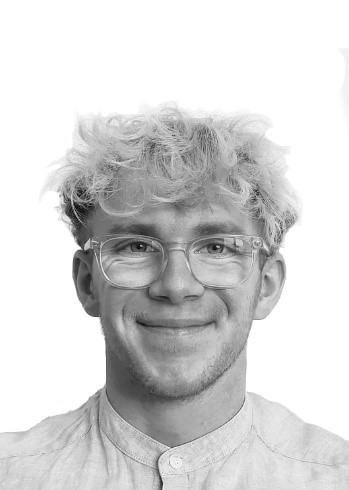

  
  

    Hi, I’m Antoine Bourgois, an NLP PhD student focused on <strong>coreference resolution</strong> and computational analysis of French literature (Propp-fr). 
    Contact: antoine [dot] bourgois [at] protonmail [dot] com
  

---

## Research Articles
**Antoine Bourgois** and Thierry Poibeau.
2025.
[The Elephant in the Coreference Room: Resolving Coreference in Full-Length French Fiction Works.](articles/2025_CRAC_CoreferenceInFrenchNovels.pdf)
In *Proceeding of the Eighth Workshop on Computational Models of Reference, Anaphora and Coreference (CRAC 2025).* EMNLP 2025, Suzhou, China.
[arxiv](https://arxiv.org/abs/2510.15594), [hal](https://hal.science/hal-05319970).

Olga Seminck, **Antoine Bourgois**, Yoann Dupont, Mathieu Dehouck, Marine Delaborde.
2025.
[GLaRef@CRAC2025: Should We Transform Coreference Resolution into a Text Generation Task?](articles/2025_CRAC_SharedTask.pdf)
In *Proceeding of the Eighth Workshop on Computational Models of Reference, Anaphora and Coreference (CRAC 2025).* EMNLP 2025, Suzhou, China.
